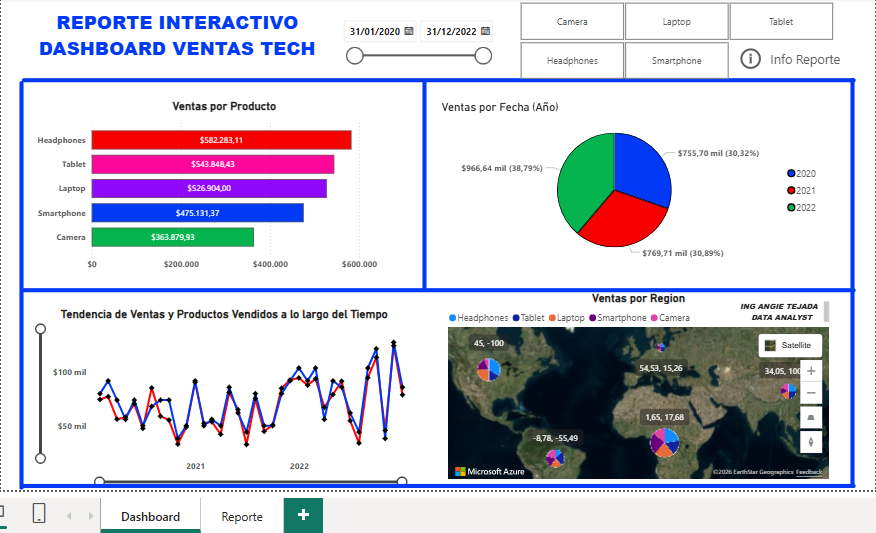

# Business-Intelligence-Power-Bi
## 📊 Descripción

Proyecto final desarrollado como parte de mi formación en Business Intelligence y Power BI.

El objetivo fue transformar datos de un e-commerce internacional en información útil para la toma de decisiones mediante dashboards interactivos y diferentes técnicas de visualización.

## 🎯 Objetivos

- Analizar el comportamiento de las ventas.
- Identificar productos y sucursales con mejor desempeño.
- Analizar la rentabilidad.
- Identificar patrones y tendencias.
- Analizar la distribución geográfica de las ventas.
- Generar proyecciones.
- Facilitar la toma de decisiones mediante indicadores y visualizaciones.

## 🛠️ Herramientas

- Power BI
- Excel
- Power Query
- DAX

## 📈 Principales análisis

El proyecto incluye:

- Análisis de ventas.
- Análisis de rentabilidad.
- Distribución geográfica.
- Mapas de ubicación estratégica.
- Análisis de sucursales.
- Gráficos de dispersión.
- Proyecciones de ventas.
- KPIs.
- Dashboards interactivos.

## 🖥️ Vista previa

## 🎥 Presentación del proyecto

[Ver presentación del proyecto en YouTube](https://www.youtube.com/watch?v=wQgOKUKVAp8)

## 📁 Archivos

- Datos_Ventas_Productos.pbix — archivo principal de Power BI.
- datos-ecommerce-businesss-intelligence.xlsx — conjunto de datos utilizado (estado sin hacer proceso ETL aún, al usarse se limpió en Power Query).
- image.png — vista previa del dashboard.

## 📅 Fecha

08/2026
